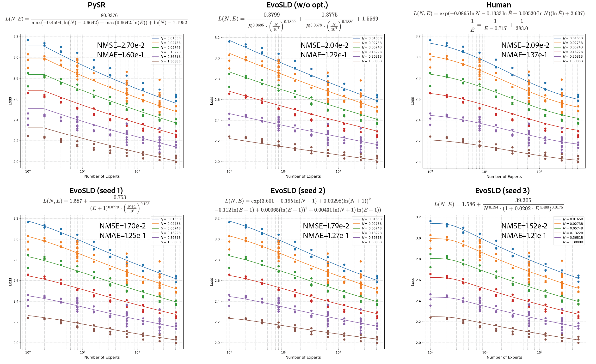

# Automated Scaling Law Discovery

EvoSLD is a framework for the automated discovery of scaling laws using Large Language Models (LLMs). It implements a novel evolutionary approach that co-evolves both the symbolic scaling law expression and its corresponding optimization algorithm. This method has been shown to rediscover, and in many cases surpass, human-designed scaling laws across a variety of complex domains.

 

**Fig 1. Comparison of MoE scaling laws.** EvoSLD (bottom row) discovers simpler and more accurate laws compared to traditional symbolic regression (PySR, top left), the human-designed law (top right), and an ablated version of itself without a co-evolving optimizer (top middle).

## ✨ Key Features

- **LLM-Powered Evolution**: Leverages the rich domain priors of LLMs to guide the evolutionary search for meaningful and physically plausible scaling laws.
- **Co-evolution Framework**: Uniquely evolves both the symbolic function and a specialized fitting algorithm, leading to significantly more accurate parameterization.
- **Superior Performance**: Outperforms traditional symbolic regression methods (like PySR, GPlearn) and has discovered laws that provide a better fit than human-derived formulas in complex scenarios.
- **Broad Applicability**: Comes with pre-configured tasks for major scaling law research areas, including vocabulary size, fine-tuning, data mixtures, Mixture-of-Experts (MoE), and data-constrained settings.
- **Extensible**: Easily add your own custom scaling law discovery tasks.

## 🚀 Quick Start

### Prerequisites

- Python 3.10+
- An OpenAI API Key

### Installation

1. **Clone the repository:**

   ```
   git clone <repository-url>
   cd SLD
   ```

2. **Install the OpenEvolve framework:**

   This project is built on OpenEvolve. Install it from the local submodule.

   ```
   cd openevolve
   pip install -e .
   cd ..
   ```

3. **Set your API key:**

   ```
   export OPENAI_API_KEY="your_openai_api_key"
   ```

### Run All Tasks

The simplest way to run all experiments is with the main script. This will execute 3 independent runs for each of the 5 scaling law tasks, evaluate the results, and generate reports.

```
bash run.sh
```

## 🎯 Covered Scenarios

EvoSLD has been validated on five diverse scaling law discovery tasks from recent literature. The goal is to find a single, universal symbolic expression (f) that accurately models the underlying behavior.

| Scenario                  | Key Variables (Inputs)                                   | Human-Designed Law                                           |
| ------------------------- | -------------------------------------------------------- | ------------------------------------------------------------ |
| **Rectified Scaling Law** | Dataset Size, Model Size                                 | $L(D) = \frac{A}{D^\alpha + B} + C$                          |
| **Vocabulary Scaling**    | Non-Vocab Params (N), Vocab Size (V), Dataset Size (D)   | $L(N, V, D) = \frac{A}{N^\alpha} + \frac{B}{V^\beta} + \frac{C}{D^\gamma} + E$ |
| **Domain Mixture**        | Domain mixture ratios (mathbfr)                          | $L_i(\mathbf{r}) = c_i + k_i \exp\left(\sum_{j=1}^M t_{ij} r_j\right)$ |
| **MoE Scaling**           | Dense Params (N), # of Experts (E)                       | $\log L(N, E) = a \log N + b \log \hat{E} + c \log N \log \hat{E} + d, \\where \frac{1}{\hat{E}} = \frac{1}{E - 1 + \left( \frac{1}{E_{\text{start}}} - \frac{1}{E_{\text{max}}} \right)^{-1}} + \frac{1}{E_{\text{max}}}$ |
| **Data Constrained**      | Model Params (N), Training Tokens (D), Unique Tokens (U) | $L(N, D, U) = E + \frac{A}{D'^\alpha} + \frac{B}{N'^{\beta}}$ ($N', D'$ has complicated form)|

In our experiments, EvoSLD successfully rediscovered the exact human-designed laws for the **Rectified** and **Vocabulary** scenarios and found *superior* laws for the **Domain Mixture** and **Data-Constrained** tasks.

## 🛠️ Manual Usage

You can also run and evaluate tasks individually.

### Running a Single Task

To run a specific task (e.g., `moe_scaling_law`), navigate to its directory and use the `openevolve-run` command:

```
cd moe_scaling_law/
openevolve-run --config config.yaml init_program.py evaluator.py --output outputs/run_0
```

### Evaluating a Discovered Law

Use the global `evaluator.py` script to test a discovered program against the dataset.

```
# The global evaluator is recommended
python evaluator.py <task_name> <path_to_discovered_program>

# Example:
python evaluator.py moe_scaling_law moe_scaling_law/outputs/run_0/best/best_program.py
```

## 🔬 How It Works: The EvoSLD Method

Traditional symbolic regression (SR) methods like PySR and GPlearn often fail at these tasks. They perform an unguided search over a combinatorial space of mathematical operators, leading to overly complex and uninterpretable expressions that don't generalize.

EvoSLD overcomes this with two key innovations:

1. **LLM-Guided Evolution**: It uses an LLM (e.g., GPT-4) as a "mutation operator." The LLM provides intelligent suggestions for modifying the current best scaling law, leveraging its vast knowledge of mathematical and physical patterns. This guides the search toward plausible and effective formulas.
2. **Optimizer Co-evolution**: Finding a good symbolic formula is only half the battle. Fitting its coefficients to noisy, sparse experimental data is a hard optimization problem. Instead of relying on a fixed, general-purpose optimizer (like BFGS), **EvoSLD co-evolves a custom Python optimization function** alongside the symbolic law. This specialized fitter leads to a much more accurate evaluation of each candidate law, dramatically improving final performance.

## 💡 Adding Your Own Task

You can easily extend the framework to discover scaling laws for your own research problems.

1. **Create Task Directory**:

   ```
   mkdir my_new_task && cd my_new_task
   ```

2. **Create `config.yaml`**: Copy a config from an existing task. The most important part is the `system_message`, which is the prompt that guides the LLM. Define your variables, data characteristics, and function signatures here.

3. **Create `init_program.py`**: Provide a simple "seed" program. A basic power law is a good starting point. This file must contain the two functions to be evolved: `scaling_law_func` and `fit_scaling_law`.

4. **Create `evaluator.py`**: Write a function to evaluate a given program. It should load your data, run the `fit_scaling_law` function to get the parameters, use `scaling_law_func` to get predictions, and return a dictionary of metrics (e.g., MSE, MAE).

5. **Add Data**: Place your dataset in a `data/` subdirectory and register it in the global `./data_loader.py`.

6. **Run**:

   ```
   openevolve-run --config config.yaml init_program.py evaluator.py --output outputs/test_run
   ```

## 📂 Project Structure

```
SLD/
├── run.sh                  # Main automation script
├── evaluator.py            # Global evaluator for all tasks
├── data_loader.py          # Data loading utilities
├── openevolve/             # Git submodule for the OpenEvolve framework
├── assets/                 # Images and figures
│   └── figure2.pdf
├── data_constrained_scaling_law/
├── domain_mixture_scaling_law/
├── moe_scaling_law/
├── rectified_scaling_law/
└── vocab_scaling_law/
```

## 📜 Citation

If you use EvoSLD in your research, please consider citing our paper:

```
@article{sld2025,
  title={EvoSLD: Automated Neural Scaling Law Discovery With Large Language Models},
  author={Lin, Haowei and Others},
  journal={ArXiv},
  year={2025}
}
```

## 🙏 Acknowledgments

- The OpenEvolve framework development team.
- The PySR and GPlearn communities for their pioneering work in symbolic regression.
- All the researchers whose work on scaling laws provided the foundation and data for this project.